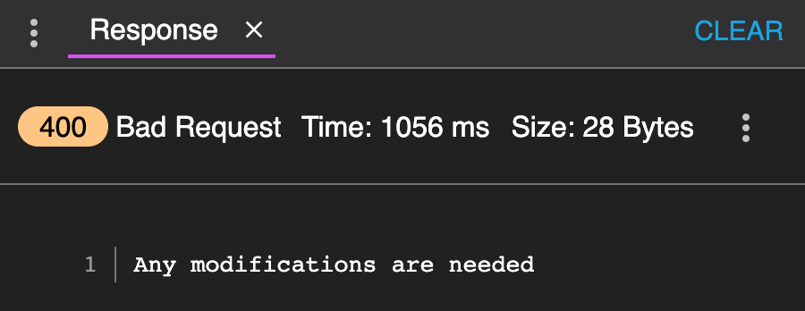
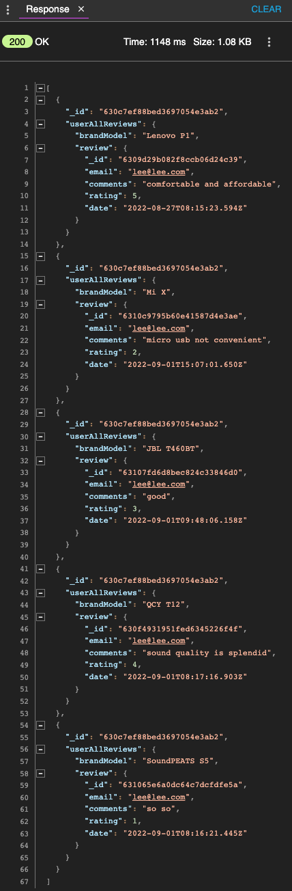

# TGCProject2 - Earphone REST API

## Context and Goals
This is a restful API designed for a project on earphone. This API was created using Nodejs, Expressjs, MongoDB, and hosted on Heroku.

## Sample Document
Earphone template
```
{
    "brandModel": <string>
    "type": <string>
    "earbuds": <boolean> i.e 'yes', 'no', 'y', 'n'
    "bluetooth": <float>
    "price": <integer>
    "stock": <array of objects> i.e [{"store": <string>, "qty": <integer>}]
    "color": <array>
    "hours": <object> i.e {"music": <integer>, "cableCharging": <integer>, "boxCharging": <integer>}
    "dustWaterproof": <boolean> i.e 'yes', 'no', 'y', 'n'
    "connectors": <string>
    "review": <array of objects> i.e [{"email": <string>, "comments": <string>, "rating": <integer>}]
}
```

User template
```
{
    "username": <string>,
    "firstname": <string>,
    "lastname": <string>,
    "email": <string>,
    "password": <string>,
    "comfirmPassword": <string>
}
```

## Guideline of API Endpoints 
|||
 --- | --- 
**Title** | A short phrase describing what the API does
**Method** | Whether it is GET, POST, PATCH, PUT or DELETE
**Endpoint Path** | The endpoint URL with URL with the possible parameters in <>
**Body** | Expected JSON object for the body for POST, PATCH and PUT requests
**Parameters** | Description of the parameters in the body and the URL
**Expected Response** | Expected JSON object for the response

## Product Routes
|||
 --- | --- 
**Title** | Retrieve all products
**Method** | GET
**Endpoint Path** | /earphone
**Body** | N/A
**Parameters** | N/A
**Expected Response** | `{ "page": 1, "limit": 2, "result": [{...},{...}]}`
|||
**Title** | Retrieve result with pagination
**Method** | GET
**Endpoint Path** | /earphone?`parameter`
**Body** | N/A
**Parameters** | page=`integer`, limit=`integer` or both by adding `&` in between
**Expected Response** | `{ "page": 1, "limit": 2, "result": [{...},{...}, {...}]}`
|||
**Title** | Retrieve result with criteria
**Method** | GET
**Endpoint Path** | /earphone?`parameter`
**Body** | N/A
**Parameters** |  type=`string`, hours=`integer`, store=`string`, color=`string`, min_price=`integer/float`, max_price=`integer/float`
|| Inverse: otherColor=`string`, rating=`integer`
**Expected Response** | `{ "page": 1, "limit": 2, "result": [{...},{...}]}`
|||
**Title** | Create a new product
**Method** | POST
**Endpoint Path** | /add
**Body** | earphone template **without review**
**Parameters** | N/A
**Expected Response** | `{ "message": "Created successfully" }`
|||
**Title** | Update a product
**Method** | PUT
**Endpoint Path** | /earphone/`:id`
**Body** | earphone template **without review**
**Parameters** | :id - _id of earphone object in document
**Expected Response** | `{ "message": "Updated successfully" }`
|||
**Title** | Delete a product
**Method** | Delete
**Endpoint Path** | /earphone/`:id`
**Body** | N/A
**Parameters** | :id - _id of earphone object in document
**Expected Response** | `{ "message": "Deleted successfully" }`

## Review Routes
|||
 --- | --- 
**Title** | Create a review of product
**Method** | POST
**Endpoint Path** | /earphone/`:id`/review
**Body** | **review only** in earphone template 
**Parameters** | :id - _id of earphone object in document
**Expected Response** | `{ "message": "Created successfully" }`
||| 
**Title** | Retrive a review of product
**Method** | GET
**Endpoint Path** | /earphone/`:id`/review
**Body** | N/A 
**Parameters** | :id - _id of earphone object in document
**Expected Response** | `{ "_id": <string>, "brandModel": <string>, "review": <array of objects> }`
||| 
**Title** | Retrive all reviews of user
**Method** | GET
**Endpoint Path** | /user/review?
**Body** | N/A 
**Parameters** | N/A
**Expected Response** | `[{ "_id": <string>, "userAllReviews": <array of objects> i.e "brandModel": <string>, "review": <array of objects> }]`
||| 
**Title** | Update a review of product
**Method** | PUT 
**Endpoint Path** | /earphone/`:id`/review/`:reviewid`
**Body** | **review without email** in earphone template
**Parameters** | :id - _id of earphone object in document, :reviewid - _id of earphone project in document
**Expected Response** | `{ "message": "Updated successfully" }`
||| 
**Title** | Delete a review of product
**Method** | DELETE 
**Endpoint Path** | /earphone/`:id`/review/`:reviewid`
**Body** | N/A
**Parameters** | :id - _id of earphone object in document, :reviewid - _id of earphone project in document
**Expected Response** | `{ "message": "Deleted successfully" }`

## User Routes
|||
 --- | --- 
**Title** | Sign up
**Method** | POST
**Endpoint Path** | /signup
**Body** | user template
**Parameters** | N/A
**Expected Response** | `{ "message": "<email> is registred successfully" }`
|||
**Title** | Login
**Method** | POST
**Endpoint Path** | /login
**Body** | `{ "email": "<email>", "password": "<password>" }`
**Parameters** | N/A
**Expected Response** | `{ "message": "Logged in", "accessToken": "<JWT token>" }`
|||
**Title** | Update a user
**Method** | PUT
**Endpoint Path** | /user/`:id`
**Body** | user template **without email, password, and comfirmPassword**
**Parameters** | :id - _id of user object in document
**Expected Response** | `{ "message": "Updated successfully" }`
|||
**Title** | Delete a user
**Method** | Delete
**Endpoint Path** | /user/`:id`
**Body** | N/A
**Parameters** | :id - _id of user object in document
**Expected Response** | `{ "message": "Deleted successfully" }`

## Other Route
|||
 --- | --- 
**Title** | Redirect not found pages
**Method** | ALL
**Endpoint Path** | N/A
**Body** | N/A
**Parameters** | N/A
**Expected Response** | `Server could not find what was requested`

## Test Cases
## Product
|||
 --- | --- 
**Method** | POST
**Endpoint Path** | /add
**Body & Expected Response** | 
|||
**Method** | GET
**Endpoint Path** | /earphone
**Body & Expected Response** | 
|||
**Method** | GET
**Endpoint Path** | /earphone?color=blue
**Body & Expected Response** | 
|||
**Method** | GET
**Endpoint Path** | /earphone?page=1&limit=1
**Body & Expected Response** | 
|||
**Method** | PUT
**Endpoint Path** | /earphone/630ef7f15ea1b97eebcbbe75
**Body & Expected Response** | !
|||
**Method** | DELETE
**Endpoint Path** | /earphone/630ef7f15ea1b97eebcbbe75
**Body & Expected Response** | 
|||
**Method** | ALL
**Endpoint Path** | /earphone/630ef7f15ea1b97eebcbbe7555/review
|| /earphone/630ef7f15ea1b97eebcbbe75=/review
**Body & Expected Response** | 
|||
**Method** | GET
**Endpoint Path** | /earphone/6308e842fa01e789ba8742ca/review
**Body & Expected Response** | 
|||
**Method** | GET
**Endpoint Path** | /user/review?
**Body & Expected Response** | 
|||
**Method** | POST
**Endpoint Path** | /earphone/630f50922297a3ca1c561322/review
**Body & Expected Response** | 
|||
**Method** | PUT
**Endpoint Path** | /earphone/6308e842fa01e789ba8742ca/review/6309c51829020664650c06ac
**Body & Expected Response** | 
|||
**Method** | DELETE
**Endpoint Path** | earphone/6308e842fa01e789ba8742ca/review/6309c51829020664650c06ac
**Body & Expected Response** | 
|||
**Method** | POST
**Endpoint Path** | /signup
**Body & Expected Response** |  
|||
**Method** | POST
**Endpoint Path** | /login
**Body & Expected Response** | 
|||
**Method** | PUT
**Endpoint Path** | /user/630f4caaffb13891f245dd3c
**Body & Expected Response** | 