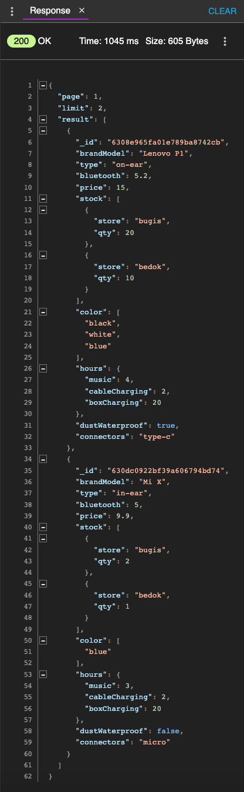

# TGCProject2 - Earphone REST API

## Context and Goals
This is a restful API designed for a project on earphone. This API was created using Nodejs, Expressjs, MongoDB, and hosted on Heroku.

## Demo


A live website of the application can be found [here]().

## Sample Document
Earphone document
```
{
    "brandModel": <string>
    "type": <string>
    "earbuds": <boolean>
    "bluetooth": <float>
    "price": <integer>
    "stock": <array of objects> i.e [{"store": <string>, "qty": <integer>}]
    "color": <array>
    "hours": <object> i.e {"music": <integer>, "cableCharging": <integer>, "boxCharging": <integer>}
    "dustWaterproof": <boolean>
    "connectors": <string>
    "review": <array of objects> i.e [{"email": <string>, "comments": <string>, "rating": <integer>}]
}
```
User document
```
{
    "username": <string>,
    "firstname": <string>,
    "lastname": <string>,
    "email": <string>,
    "password": <string>,
    "comfirmPassword": <string>
}
```

## API endpoints
| Guideline ||
 --- | --- 
**Title** | A short phrase describing what the API does
**Method** | Whether it is GET, POST, PATCH, PUT or DELETE
**Endpoint Path** | The endpoint URL with URL with the possible parameters in <>
**Body** | Expected JSON object for the body for POST, PATCH and PUT requests
**Parameters** | Description of the parameters in the body and the URL
**Expected Response** | Expected JSON object for the response
---
|||
 --- | --- 
**Title** | Login
**Method** | POST
**Endpoint Path** | /login
**Body** | `{ "email": "<email>", "password": "<password>" }`
**Parameters** | N/A
**Expected Response** | `{ "message": "Logged in", "accessToken": "<JWT token>" }`
---
|||
 --- | --- 
**Title** | Retrieve all earphones with default pagination
**Method** | GET
**Endpoint Path** | /earphone
**Body** | N/A
**Parameters** | N/A
**Expected Response** | 
---
|||
 --- | --- 
**Title** | Retrieve earphone with pagination
**Method** | GET
**Endpoint Path** | /earphone?page=1&limit=3
**Body** | N/A
**Parameters** | N/A
**Expected Response** | 
---
|||
 --- | --- 
**Title** | Retrieve result with criteria
**Method** | GET
**Endpoint Path** | /earphone?*parameter*
**Body** | N/A
**Parameters** |  type, hours, store, color, min_price, max_price
|| Inverse: otherColor, rating
**Expected Response** | 