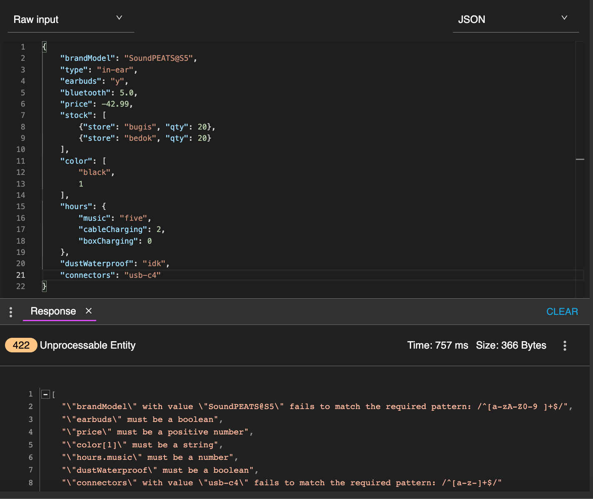
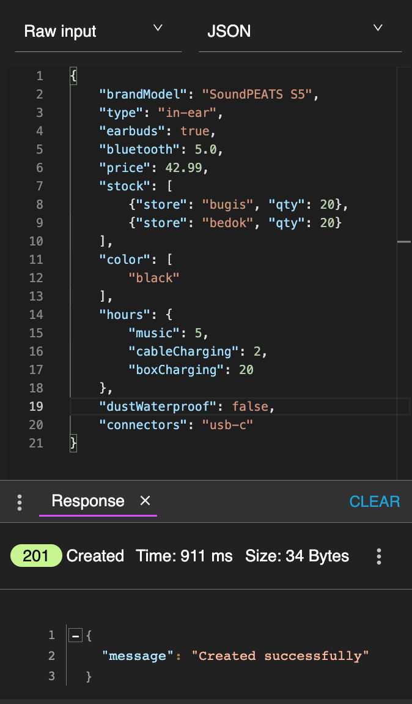
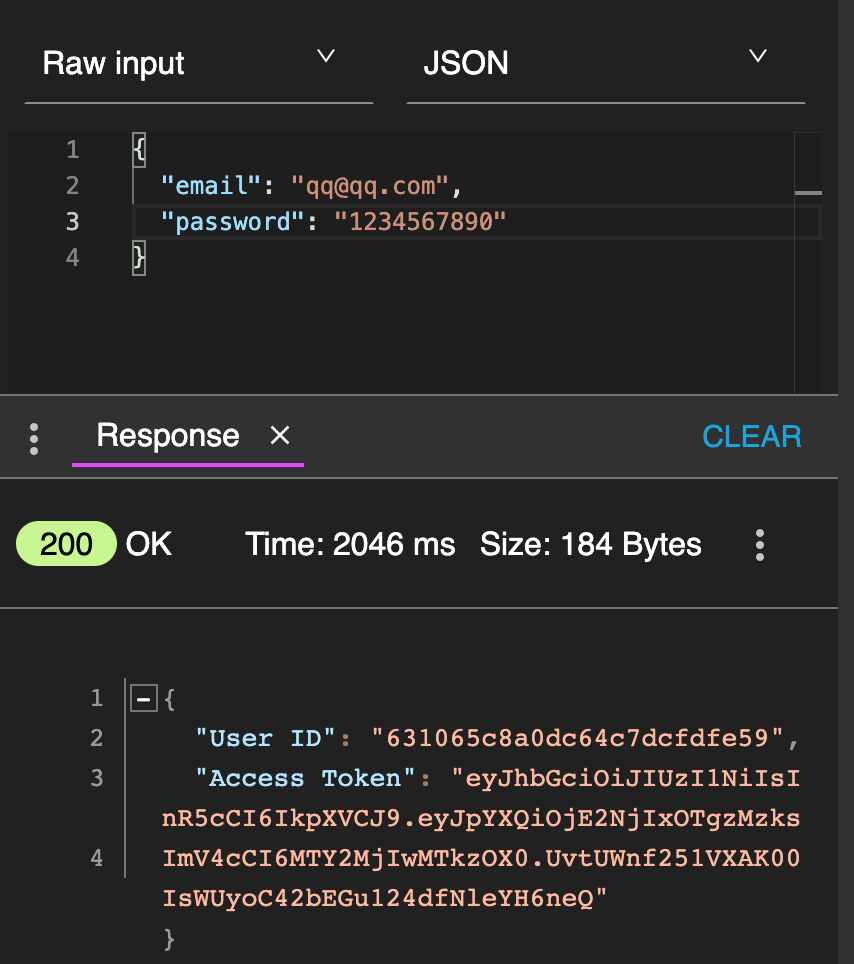

# TGCProject2 - Bluetooth Earphone REST API

## Intro
This is a restful API designed for a project on bluetooth earphone. This API was created using Nodejs, Expressjs, MongoDB, and hosted on Heroku ([Link Here](https://tgc-earphone-review-rest-api.herokuapp.com "https://tgc-earphone-review-rest-api.herokuapp.com")).

User are able to search, read, edit, delete the earphone post with login authentication (email and password). Although our server is built encryption system to hash all the users' password, please don't use any online banking related password. 

## Context
Bluetooth earphones are growing popular nowadays. Most people own at least one as their daily commuter companion to embrace themselves with their favorite music/drama/video/calls/etc or just to give themselves a peaceful noise reduced environment.

## Goal
Thus our goal is to gather information of bluetooth earphone about any best budget friendly/functional purposed/branded or not as long as long it works. Any features include prices, color, connector types, battery life, water and dustproof etc.

## Target Audience
Any bluetooth user can contirbute their user experiences or anyone who need a shopping research before purchasing. 

## Tech used
**Backend**
- `Node.js` a JavaScript runtime built on Chrome's V8 JavaScript engine
- `Express.js` a web application framework for Node.js
- `MongoDB` a NoSQL database system
- `Cross-Origin Resource Sharing/CORS` a mechanism allows server to indicate any origins (domain, scheme, or port) other than its own
- `joi` a npm package as data validator for JavaScript
- `dotenv` a npm package to store configuration in the environment separate from code
- `jsonwebtoken/JWT` a npm package to share security information between two parties — a client and a server
- `bcrypt.js` a npm package enables storing passwords as hashed passwords instead of plaintext

**Platform and Software**
- `Github` an Internet hosting service for software development and version control using Git
- `Gitpod` a platform for remote software development
- `Heroku` a cloud platform helps developers to build, run, and operate applications entirely
- `Advanced REST Client` a API testing tool

## Sample Document
Earphone collection template
```
{
    "brandModel": <string>
    "type": <string>
    "earbuds": <boolean> i.e true, false
    "bluetooth": <float>
    "price": <integer>
    "stock": <array of objects> i.e [{"store": <string>, "qty": <integer>}]
    "color": <array>
    "hours": <object> i.e {"music": <integer>, "cableCharging": <integer>, "boxCharging": <integer>}
    "dustWaterproof": <boolean> i.e true, false
    "connectors": <string>
    "review": <array of objects> i.e [{"email": <string>, "comments": <string>, "rating": <integer>}]
}
```

User collection template
```
{
    "username": <string>,
    "firstname": <string>,
    "lastname": <string>,
    "email": <string>,
    "password": <string>,
    "comfirmPassword": <string>
}
```

## Guidelines of API Endpoint
|||
 --- | --- 
**Title** | A short phrase describing what the API does
**Method** | Whether it is GET, POST, PATCH, PUT or DELETE
**Endpoint Path** | The endpoint URL with URL with the possible parameters in <>
**Body** | Expected JSON object for the body for POST, PATCH and PUT requests
**Parameters** | Description of the parameters in the body and the URL
**Expected Response** | Expected JSON object for the response

## Product Routes
|||
 --- | --- 
**Title** | Retrieve all products
**Method** | GET
**Endpoint Path** | /earphone
**Body** | N/A
**Parameters** | N/A
**Expected Response** | `{ "page": 1, "limit": 2, "result": [{...},{...}]}`
|||
**Title** | Retrieve result with criteria or/and pagination
**Method** | GET
**Endpoint Path** | /earphone?`parameter(s) or empty`
**Body** | N/A
**Parameters** |  type=`string`, store=`string`, color=`string`, min_price=`integer/float`, max_price=`integer/float`
|| Inverse: otherHours=`integer`, otherColor=`string`, otherType=`string`
|| page=`integer` or/and limit=`integer`
|| adding `&` in between parameters to match your query
**Expected Response** | `{ "page": 1, "limit": 2, "result": [{...},{...}]}`
|||
**Title** | Create a new product
**Method** | POST
**Endpoint Path** | /add
**Body** | earphone collection template **without review**
**Parameters** | N/A
**Expected Response** | `{ "message": "Created successfully" }`
|||
**Title** | Update a product
**Method** | PUT
**Endpoint Path** | /earphone/`:id`
**Body** | earphone collection collection template **without review**
**Parameters** | :id - _id of earphone object in document
**Expected Response** | `{ "message": "Updated successfully" }`
|||
**Title** | Delete a product
**Method** | Delete
**Endpoint Path** | /earphone/`:id`
**Body** | N/A
**Parameters** | :id - _id of earphone object in document
**Expected Response** | `{ "message": "Deleted successfully" }`

## Review Routes
|||
 --- | --- 
**Title** | Create a review of product
**Method** | POST
**Endpoint Path** | /earphone/`:id`/review
**Body** | **review only** in earphone template 
**Parameters** | :id - _id of earphone object in document
**Expected Response** | `{ "message": "Created successfully" }`
||| 
**Title** | Retrive a review of product
**Method** | GET
**Endpoint Path** | /earphone/`:id`/review
**Body** | N/A 
**Parameters** | :id - _id of earphone object in document
**Expected Response** | `{ "_id": <string>, "brandModel": <string>, "review": <array of objects> }`
||| 
**Title** | Retrive all reviews of user
**Method** | GET
**Endpoint Path** | /user/`:id`/`:email`/review
**Body** | N/A 
**Parameters** | :id - _id of user object in document, :email - full email of user object in document
|| page=`integer` or/and limit=`integer`
|| adding `&` in between parameters to match your query
**Expected Response** | `{"page": 1, "limit": 2, "result": [{ "_id": <string>, "userAllReviews": <objects> i.e "brandModel": <string>, "review": <objects> }]}`
||| 
**Title** | Update a review of product
**Method** | PUT 
**Endpoint Path** | /earphone/`:id`/review/`:reviewid`
**Body** | **review without email** in earphone template
**Parameters** | :id - _id of earphone object in document, :reviewid - _id of earphone project in document
**Expected Response** | `{ "message": "Updated successfully" }`
||| 
**Title** | Delete a review of product
**Method** | DELETE 
**Endpoint Path** | /earphone/`:id`/review/`:reviewid`
**Body** | N/A
**Parameters** | :id - _id of earphone object in document, :reviewid - _id of earphone project in document
**Expected Response** | `{ "message": "Deleted successfully" }`

## User Routes
|||
 --- | --- 
**Title** | Sign up
**Method** | POST
**Endpoint Path** | /signup
**Body** | user template
**Parameters** | N/A
**Expected Response** | `{ "message": "<email> is registred successfully" }`
|||
**Title** | Login
**Method** | POST
**Endpoint Path** | /login
**Body** | `{ "email": "<email>", "password": "<password>" }`
**Parameters** | N/A
**Expected Response** | `{ "User ID" : <id>, "Access Token": "<JWT token>" }`
|||
**Title** | Update a user
**Method** | PUT
**Endpoint Path** | /user/`:id`
**Body** | user template **without email, password, and comfirmPassword**
**Parameters** | :id - _id of user object in document
**Expected Response** | `{ "message": "Updated successfully" }`
|||
**Title** | Delete a user
**Method** | Delete
**Endpoint Path** | /user/`:id`
**Body** | N/A
**Parameters** | :id - _id of user object in document
**Expected Response** | `{ "message": "Deleted successfully" }`

## Other Route
|||
 --- | --- 
**Title** | Redirect not found pages
**Method** | ALL
**Endpoint Path** | N/A
**Body** | N/A
**Parameters** | N/A
**Expected Response** | `Server could not find what was requested`

## Testing (Success, Failure, Fringe)
## Product Cases
|||
 --- | --- 
**Method** | POST
**Endpoint Path** | /add
**Body & Expected Response** | 
|||
**Method** | GET
**Endpoint Path** | /earphone
**Body & Expected Response** | 
|||
**Method** | GET
**Endpoint Path** | /earphone?color=blue
**Body & Expected Response** | 
|||
**Method** | GET
**Endpoint Path** | /earphone?page=1&limit=1
**Body & Expected Response** | 
|||
**Method** | GET
**Endpoint Path** | /earphone?color=yellow&type=in-ear&page=1&limit=5
**Body & Expected Response** | 
|||
**Method** | PUT
**Endpoint Path** | /earphone/630ef7f15ea1b97eebcbbe75
**Body & Expected Response** | !
|||
**Method** | DELETE
**Endpoint Path** | /earphone/630ef7f15ea1b97eebcbbe75
**Body & Expected Response** | 

## Review Cases
|||
 --- | --- 
**Method** | GET
**Endpoint Path** | /earphone/6308e842fa01e789ba8742ca/review
**Body & Expected Response** | 
|||
**Method** | GET
**Endpoint Path** | /user/630c7ef88bed3697054e3ab2/lee@lee.com/review?page=2&limit=2
**Body & Expected Response** | 
|||
**Method** | POST
**Endpoint Path** | /earphone/630f50922297a3ca1c561322/review
**Body & Expected Response** | 
|||
**Method** | PUT
**Endpoint Path** | /earphone/6308e842fa01e789ba8742ca/review/6309c51829020664650c06ac
**Body & Expected Response** | 
|||
**Method** | DELETE
**Endpoint Path** | earphone/6308e842fa01e789ba8742ca/review/6309c51829020664650c06ac
**Body & Expected Response** | 

## User Cases
|||
 --- | --- 
**Method** | POST
**Endpoint Path** | /signup
**Body & Expected Response** |  
|||
**Method** | POST
**Endpoint Path** | /login
**Body & Expected Response** | 
|||
**Method** | PUT
**Endpoint Path** | /user/630f4caaffb13891f245dd3c
**Body & Expected Response** | 

## Other Cases
|||
 --- | --- 
**Method** | GET/POST/PUT/DELETE
**Endpoint Path** | no JWT access except `/login`, `/signup` and `404 route`
**Body & Expected Response** | 
|||
**Method** | ALL/GET/POST/PUT/DELETE
**Endpoint Path** | any route typo or doesn't match validation
**Body & Expected Response** |  
|||
**Method** | GET/POST/PUT/DELETE
**Endpoint Path** | `parameter` or `query` not found in database
**Body & Expected Response** | 
|||
**Method** | GET/POST/PUT/DELETE
**Endpoint Path** | data not found in database
**Body & Expected Response** | 

## Credits
- Trent Global College & Tutor Paul [Link](https://www.trentglobal.edu.sg/diplomainsoftwaredevelopment/)
- Stack Overflow for coding issues [Link](https://stackoverflow.com/questions/69416996/why-does-my-mongodb-nodejs-driver-query-on-aggregate-lookup-not-return-results)
- MongoDB documentation [$unwind](https://www.mongodb.com/docs/manual/reference/operator/aggregation/unwind/)
- StackChief [$lookup](https://www.stackchief.com/tutorials/%24lookup%20Examples%20%7C%20MongoDB)
- joi documentation [Link](https://joi.dev/api/?v=17.6.0)
- Youtube videos ([joi validator](https://www.youtube.com/watch?v=_svzevhv4vg&t=5s), [bcrypt.js](https://www.youtube.com/watch?v=2jqok-WgelI&t=1181s))